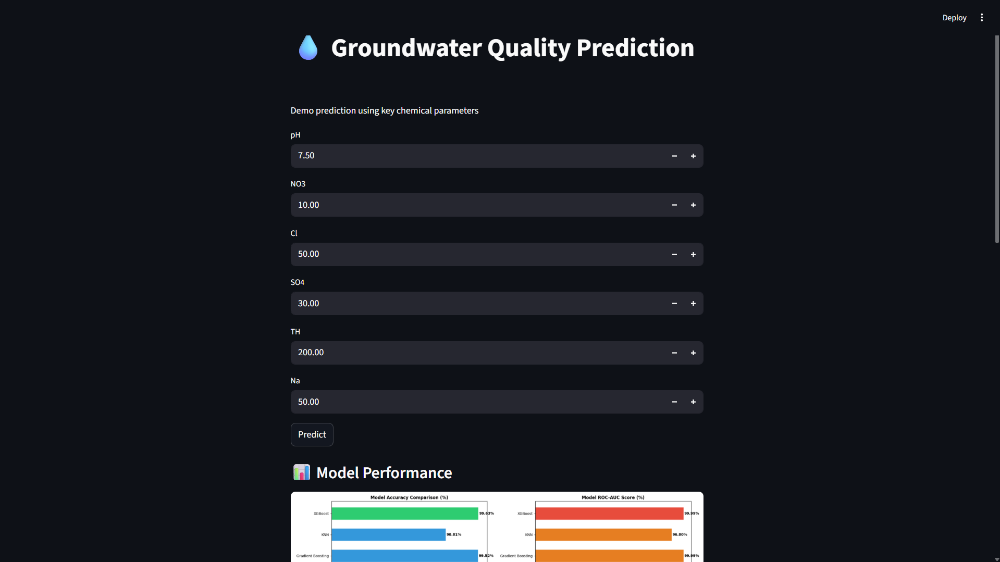

# 💧 Groundwater Quality Prediction using Machine Learning

## 📌 Overview

This project predicts whether groundwater is **safe or unsafe for drinking** using machine learning techniques based on chemical parameters such as pH, nitrate (NO3), chloride (Cl), sulfate (SO4), hardness (TH), and more.

It demonstrates a complete **end-to-end ML pipeline** from data preprocessing to model deployment.

---

## ⚙️ Workflow

1. Data Cleaning & Preprocessing
2. Exploratory Data Analysis (EDA)
3. Feature Engineering
4. Model Training (Multiple ML models)
5. Model Evaluation (Accuracy, ROC-AUC, Confusion Matrix)
6. Final Model Selection (Voting Classifier)
7. Deployment using Streamlit

---

## 🤖 Models Used

* Logistic Regression
* Decision Tree
* Random Forest
* Gradient Boosting
* K-Nearest Neighbors (KNN)
* XGBoost
* Voting Classifier (Final Model)

---

## 📊 Results

* High accuracy achieved using ensemble methods
* Strong ROC-AUC performance
* Important chemical parameters identified
* Reliable classification of safe vs unsafe water

---

## 🌐 Streamlit Web App

A simple web interface is built using Streamlit to allow users to input chemical parameters and get predictions.

⚠️ **Note:**
The original model was trained on a larger set of features. The Streamlit app uses a simplified input set for demonstration, so predictions may not always be perfectly accurate.

---

## 🚀 How to Run Locally

### 1. Clone the repository

```bash
git clone https://github.com/tkacha467/groundwater-quality-prediction-ml.git
cd groundwater-quality-prediction-ml
```

### 2. Install dependencies

```bash
pip install -r requirements.txt
```

### 3. Run the application

```bash
streamlit run app.py
```

---

## 📁 Project Structure

```
ML_PROJECT/
│── app.py
│── Groundwater_Quality_Simple_Explained.ipynb
│── groundwater_with_WQI.xlsx
│── requirements.txt
│
├── results/
│   ├── models/
│   │   ├── soft_voting_final.pkl
│   │   └── scaler.pkl
│   │
│   ├── plots/
│   └── reports/
```

---

## 📸 Demo (Optional)

*Add your Streamlit screenshot here*

```

```

---

## 🧠 Key Learnings

* Importance of data preprocessing and feature engineering
* Model comparison and evaluation techniques
* Handling multiple ML models and selecting best one
* Basics of deploying ML models using Streamlit

---

## 👨‍💻 Author

**Tushar Kacha**
**Kishor Goraniya**
**Vishal Amethiya**
M.Sc. Data Science Student

---

## ⭐ Conclusion

This project showcases how machine learning can be used to analyze water quality and assist in identifying safe drinking water using data-driven methods.
